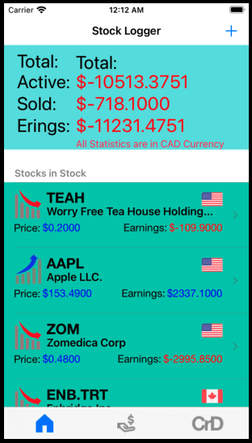
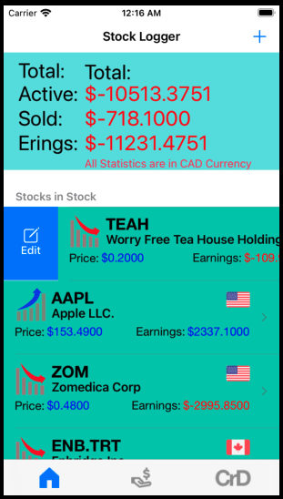
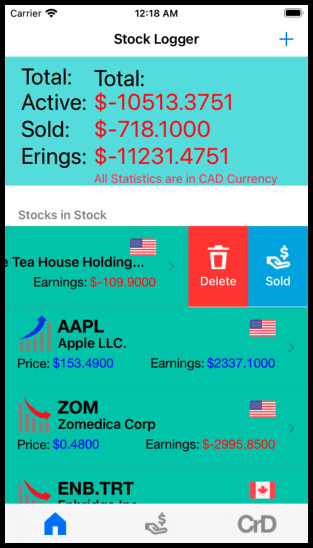
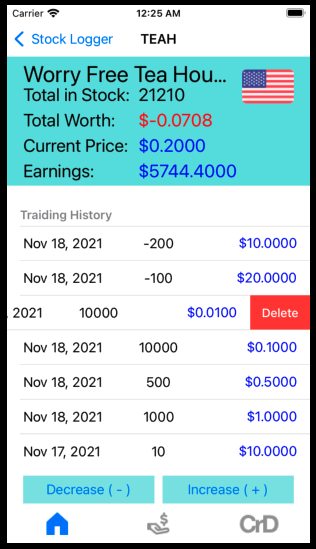
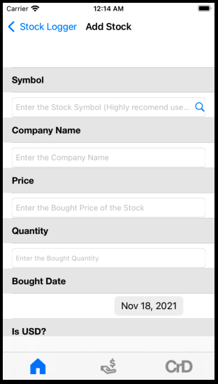
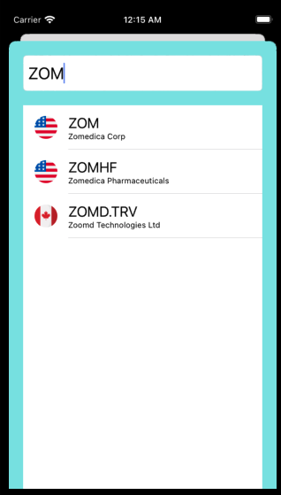
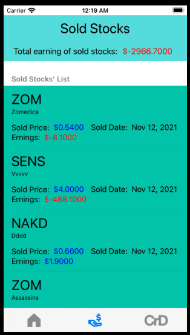

# Stock Logger

## Contributor:
#### Name: Prof. Darren Takaki

## Author:
#### Name: Ibrahim (Wusiman Yibulayin)
#### Student ID: 0728356

## Table of contents
* [Description](#description)
* [Getting Started](#getting-started)
* [Model](#model)
* [Prerequisites](#prerequisites)
* [Screen Shots](#screen-shots)
* [Acknowledgments](#acknowledgments)

## Description
When we are trading stocks, we need to calculate profit or loss.
Most stock trading software does not calculate the detailed costs.
In this app, you just need to log into your bought or sold stocks.
You can estimate the selling price by setting your willing profit.

## Getting Started
Stock Logger is an iOS app, and it is very easy to use.
You can use this app to log your stock tradings. You can add 
stock which you bought in the stock market, and the app
will calculate the profit of that stock. you can increase and
decrease your holding stock's amount when you bought or sold 
some quantity of a specific stock. You can log sold stocks in 
this app, and the system will display them separately. Because the user 
of this app only targetted Canadians, so this app only records
stocks in the US stock market and Canadian stock market. This
calculated the exact worth of a stock based on 5.95 commision of broker

## Model
### Model Name: StockModel
### Entities:
### 1. Stock Entity
#### Fields:
<table>
    <tr>
        <th>Field Name</th>
        <th>Data Type</th>
    </tr>
    <tr>
        <td>symbol</td>
        <td>String</td>
    </tr>
    <tr>
        <td>companyName</td>
        <td>String</td>
    </tr>
    <tr>
        <td>pricee</td>
        <td>Double</td>
    </tr>
    <tr>
        <td>worth</td>
        <td>Double</td>
    </tr>
    <tr>
        <td>quantity</td>
        <td>Int16</td>
    </tr>
    <tr>
        <td>earnings</td>
        <td>Double</td>
    </tr>
    <tr>
        <td>is_usd</td>
        <td>Boolen</td>
    </tr>
</table>

### 2. ActiveStock Entity
#### This entity is related with Stock Entity as one(Stock) to many(ActiveStock)
#### Fields:
<table>
    <tr>
        <th>Field Name</th>
        <th>Data Type</th>
    </tr>
    <tr>
        <td>boughtPrice</td>
        <td>Double</td>
    </tr>
    <tr>
        <td>quantity</td>
        <td>Int16</td>
    </tr>
    <tr>
        <td>boughtDate</td>
        <td>Date</td>
    </tr>
    <tr>
        <td>worth</td>
        <td>Double</td>
    </tr>
</table>

### 4. SoldStock Entity
#### Entity Fields:
<table>
    <tr>
        <th>Field Name</th>
        <th>Data Type</th>
    </tr>
    <tr>
        <td>symbol</td>
        <td>String</td>
    </tr>
    <tr>
        <td>companyName</td>
        <td>String</td>
    </tr>
    <tr>
        <td>soldPrice</td>
        <td>Double</td>
    </tr>
    <tr>
        <td>earnings</td>
        <td>Double</td>
    </tr>
    <tr>
        <td>isUSD</td>
        <td>Boolen</td>
    </tr>
    <tr>
        <td>quantity</td>
        <td>Double</td>
    </tr>
    <tr>
        <td>soldDate</td>
        <td>Date</td>
    </tr>
</table>

## Prerequisites
This application can be installed on iPhone, iPad and iPod Touch

## Screen Shots

### Images of home screen
<kbd></kbd>

### Images of right and left swipe
<kbd></kbd>
<kbd></kbd>

### Images of detail view screen
<kbd></kbd>

### Images of Add Stock Screen
<kbd></kbd>

### Images of Search Stock Screen
<kbd></kbd>

### Image of Sold Stock Screen
<kbd></kbd>

### Image of Credits Fragment
<kbd></kbd>

## Acknowledgments
I want to especially thank my teacher Prof. Darren Takaki.

